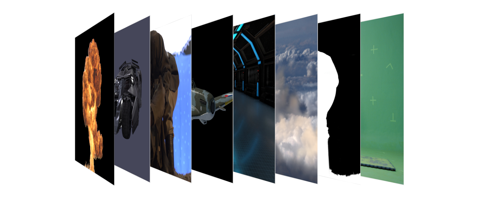
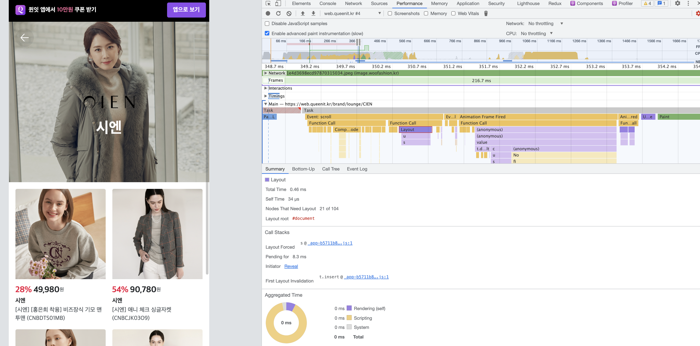
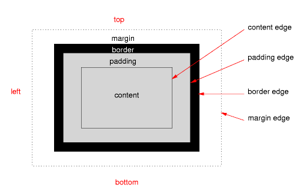
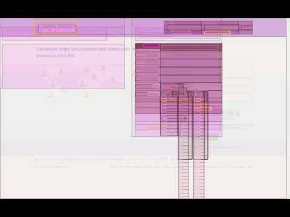
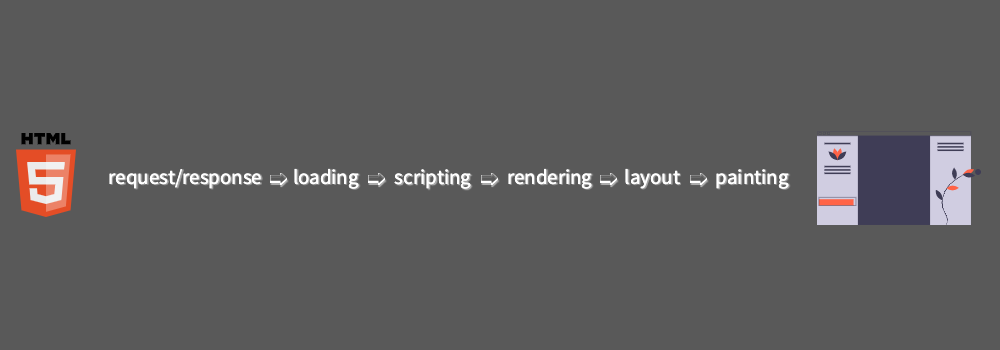

# How Browser Works + Renders


*2021.Dec.*
Product Team
FE engineer
박세문

---

# 시작하며

## How Browser works

- Tali Garsiel이
- [HTML5ROCKS](https://www.html5rocks.com/en/tutorials/internals/howbrowserswork/)에 작성한 글 (10년전)
- 근데 왜 지금?


---

## Why

- Performance
  - 왜 하는지, 어떻게 해야 하는지 알아야 제대로 된 성능 향상을 꾀할 수 있다.
- Expandable concept
  - 웹 뿐만 아니라 native application, network fetching 까지 확장 가능


---

# Good To know

아래에 대해서 알고 있으면 좋습니다

- Tree structure


---

- Compositing



---

- IO cost
- Network cost
- Hardware acceleration
- Multi process/Single process program

---

# What is Browser


___


# Browser's High level structure


- 사용자 인터페이스
- 브라우저 엔진
- 렌더링 엔진
- 통신
- JSInterpreter
- Data Persistence

---

# Rendering?


---

# Rendering in Browser


---

# Main flow


1. Parse HTML -> DOM Tree
2. Parse CSS & styles -> attact to Dom Tree
3. Build Render Tree
4. Layout Render Tree
5. Draw Render Tree


---


---


---

# HTML Parser

- [Naver D2 blog](https://d2.naver.com/helloworld/59361)
- [HTML5Rocks](https://www.html5rocks.com/en/tutorials/internals/howbrowserswork/)
- [Chromium inside Browser Pt3](https://developers.google.com/web/updates/2018/09/inside-browser-part3?hl=ko)

- `.html` -> `DOM tree`
---


---

# CSS Parser 


- [Creating Render tree](https://developers.google.com/web/fundamentals/performance/critical-rendering-path/render-tree-construction?hl=ko)

---


---

# Render Tree

```
class RenderObject{
  virtual void layout();
  virtual void paint(PaintInfo);
  virtual void rect repaintRect();
  Node* node;  //the DOM node
  RenderStyle* style;  // the computed style
  RenderLayer* containgLayer; //the containing z-index layer
}
``` 

---


---

# Layout


- 현재까지 본 것: 어떤 node가 그려질지(혹은 아닐지), node의 style을 계산
- device의 viewport안에서 position, size를 calculate해야 한다 => this is `Layout`

---



---

# Layout (cont.)

- Layout: calculate layout  


---

# Layout (cont.)



- 최종 output render tree node의 layout 형태
- 이후 paint 이벤트를 발생시켜서 각 node들을 pixel로 변환, 각 layer에 paint 후 compositing하는 과정 수행

---

# Layout finalize

[](http://www.youtube.com/watch?v=9-ezi9pzdj0 "CSS Reflow")

---
# Paint 

---

# Summary



---

- 브라우저가 서버에게 HTML 파일을 요청cri하고 서버는 응답합니다.(request/response)
- 서버에게 받은 HTML 파일을 로딩합니다.(loading)
- HTML을 한줄 한줄씩 읽어서 DOM과 CSSOM으로 변환합니다.(scripting)
- DOM과 CSSOM을 결합하여 렌더 트리를 형성합니다.(rendering)
- 각 노드의 위치 및 크기 계산을 합니다.(layout)
- 화면의 픽셀로 변환합니다. (painting)

---


---

### Construction Part
- 브라우저가 이해할 수 있는 브라우저만의 언어로 바꾸는 작업 파트입니다.
- DOM과 CSSOM을 만들고 Render Tree를 만드는 것까지의 부분
### Operation Part
- Render Tree를 이용해 구조 형성 및 배치 계산을 하여 화면의 픽셀로 변환합니다.
- layout, paint, composition 으로 사용자에게 보여지는 부분
- 주요 렌더링 경로를 최적화하는 작업은 위 작업들을 수행할 때 걸린 총 시간을 최소화하는 프로세스입니다.
- 초기 rendering 빠르게
- 업데이트 시간 감소

---

# Optimization

### Construction Part
- 불필요한 태그나 콘텐츠가 있는지 확인해봅니다.(불필요한 div 태그 남용)

### Operation Part
- 초기 렌더링 시간도 중요
- interaction, animation 시 paint 방지
- (translate 속성을 사용하면 composition만 발생)
---
### Example
- only composition: best
- paint occured: not bad
- layout: worst
- [CSSTriggers](https://csstriggers.com/)
  - Can check the performance of each css styles's performance

---

# Performance

- [Reference](https://web.dev/why-speed-matters/) 
  - 한글페이지 있음. 그러나 엔지니어는 영어로 보는걸 추천, 번역이 왈도체...

---

# Loading performance

### TBC

---

# Rendering performance

### TBC
